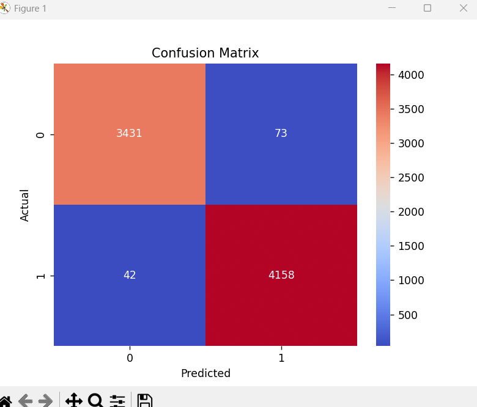

# Fake News Detection using NLP

## Overview
This project classifies news as Fake or Real using Machine Learning.

## Technologies Used
- Python
- TF-IDF Vectorizer
- Logistic Regression

## Results
- Achieved 98.5% accuracy
- Evaluated using confusion matrix

## Features
- Text preprocessing
- ML model training
- Real-time prediction function

## Files
- fake_news.py → main code
- model.pkl → trained model
- vectorizer.pkl → text vectorizer
## Model Performance
- Accuracy: 98.5%
- Confusion Matrix used for evaluation

## How to Run
1. Install requirements:
   pip install -r requirements.txt

2. Run the script:
   python fake_news.py

## Sample Prediction
Input: "Government announces new policy"
Output: Real News / Fake News
## Output

## How it Works
The model uses TF-IDF to convert text into numerical features and applies Logistic Regression to classify news articles as Fake or Real based on learned patterns.
